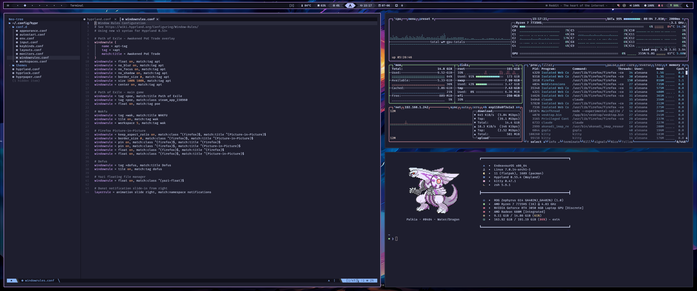
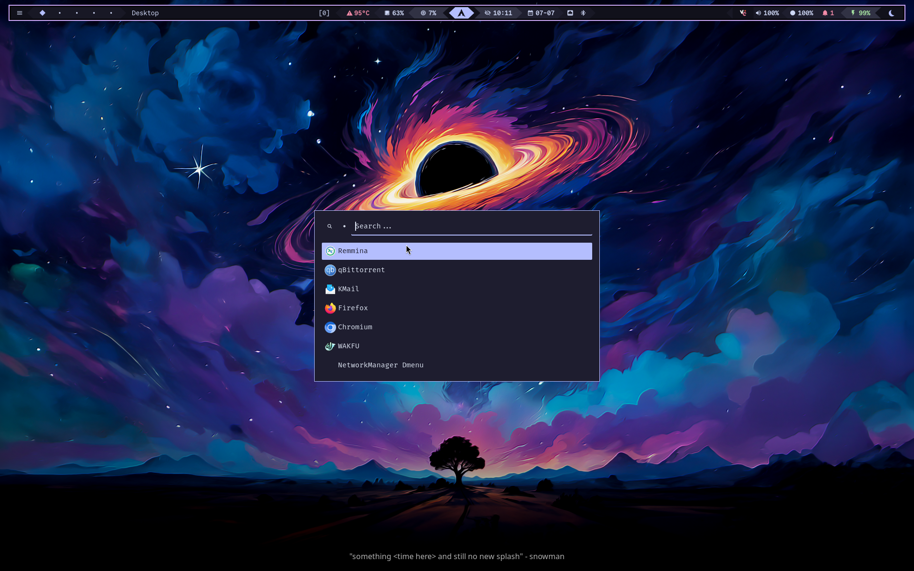
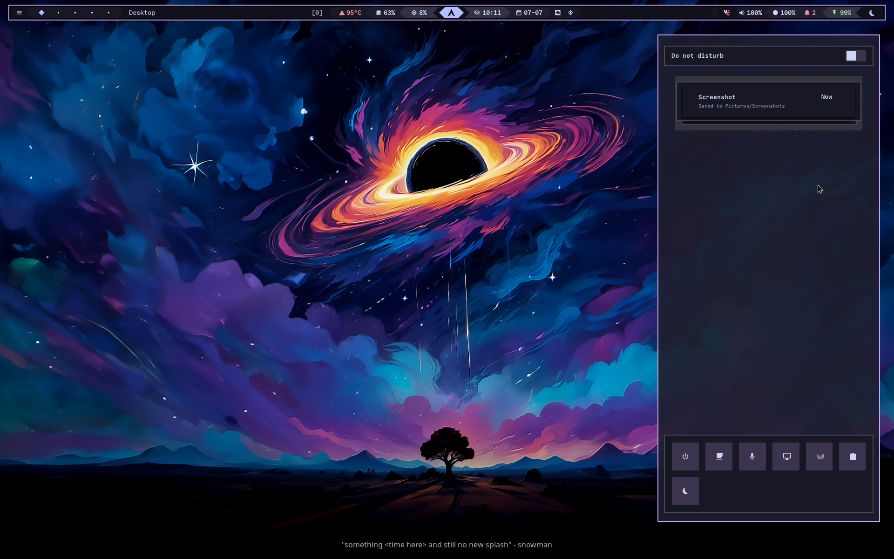
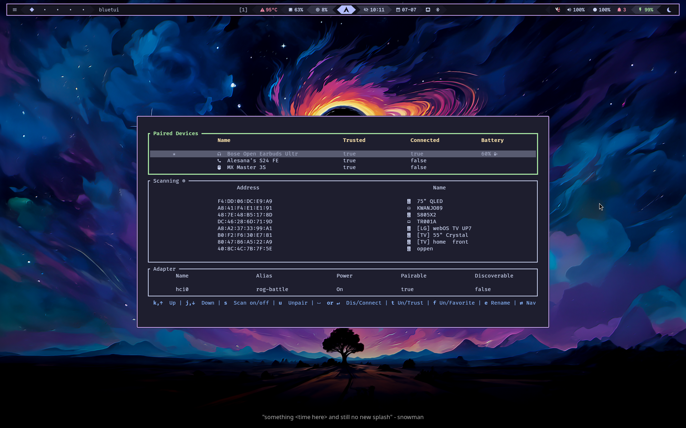
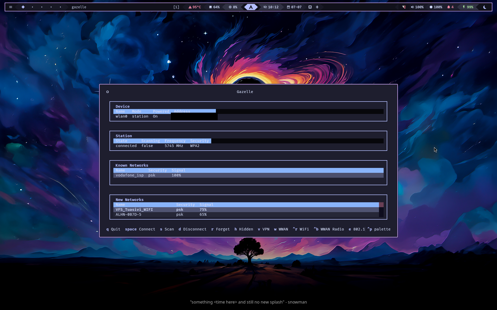
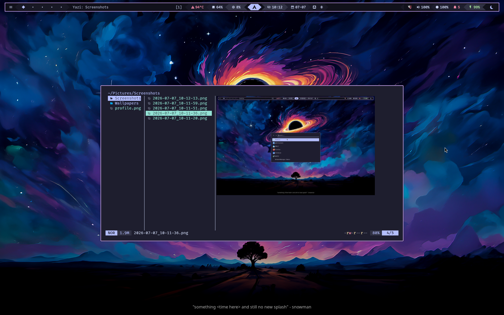
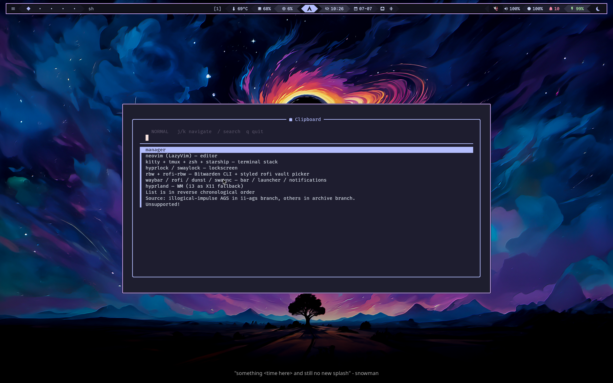
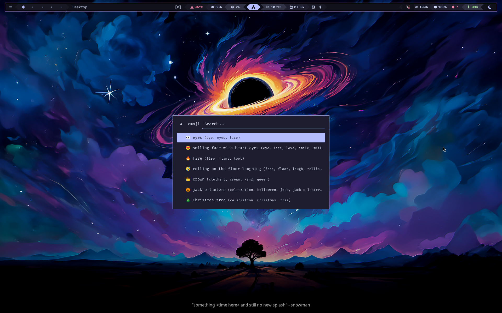

<div align="center">

# dotfiles

Catppuccin Mocha rice for Arch + Hyprland




</div>

---

## What's inside

- **[hyprland](https://github.com/hyprwm/Hyprland)** — WM ([i3](https://github.com/i3/i3) as X11 fallback)
- **[waybar](https://github.com/Alexays/Waybar) / [rofi](https://github.com/davatorium/rofi) / [dunst](https://github.com/dunst-project/dunst) / [swaync](https://github.com/ErikReider/SwayNotificationCenter)** — bar / launcher / notifications
- **[rbw](https://github.com/doy/rbw) + [rofi-rbw](https://github.com/fdw/rofi-rbw)** — Bitwarden CLI + styled rofi vault picker
- **[hyprlock](https://github.com/hyprwm/hyprlock) / [swaylock](https://github.com/swaywm/swaylock)** — lockscreen
- **[kitty](https://github.com/kovidgoyal/kitty) + [tmux](https://github.com/tmux/tmux) + [zsh](https://www.zsh.org) + [starship](https://github.com/starship/starship)** — terminal stack
- **[neovim](https://github.com/neovim/neovim) ([LazyVim](https://github.com/LazyVim/LazyVim))** — editor
- **[yazi](https://github.com/sxyazi/yazi)** — file manager
- **[bluetui](https://github.com/pythops/bluetui)** — Bluetooth TUI
- **[gazelle-tui](https://github.com/Zeus-Deus/gazelle-tui)** — NetworkManager TUI
- **[fzf](https://github.com/junegunn/fzf) + [zoxide](https://github.com/ajeetdsouza/zoxide) + [mcfly](https://github.com/cantino/mcfly)** — fuzzy find / smart cd / history
- **[grim](https://github.com/emersion/grim) + [slurp](https://github.com/emersion/slurp) + [swappy](https://github.com/jtheoof/swappy) + [wl-clipboard](https://github.com/bugaevc/wl-clipboard) + [cliphist](https://github.com/sentriz/cliphist)** — screenshots & clipboard
- **[Kvantum](https://github.com/tsujan/Kvantum) + qt5/6ct + gtk-3/4** — Qt/GTK Catppuccin theming
- **kded6** — needed for waybar's tray (`autoload=true` in kded6rc)

## Features

> App launcher — rofi with a Catppuccin theme



> Notification center — swaync with matching styling



> Bluetooth — bluetui in a floating kitty window



> Network — gazelle-tui for NetworkManager



> File picker — yazi floating, opens files in nvim



> Clipboard history — cliphist with a fuzzy picker



> Emoji picker — rofimoji, straight to clipboard



## Install

This is a [bare git repo](https://www.atlassian.com/git/tutorials/dotfiles) — files live at their real `$HOME` paths, no symlink farm. Any existing configs that would conflict are backed up to `~/.dotfiles-backup` first.

```bash
git clone --bare https://github.com/Green-Ranger11/dotfiles.git $HOME/.dotfiles
alias config='git --git-dir=$HOME/.dotfiles --work-tree=$HOME'

# back up conflicting files, then check out
mkdir -p ~/.dotfiles-backup
config checkout 2>&1 | grep -E "^\s" | awk '{print $1}' | xargs -I{} mv {} ~/.dotfiles-backup/{}
config checkout

config config --local status.showUntrackedFiles no
~/.config/scripts/install.sh
```

Packages are handled by `~/.config/scripts/install.sh`.
