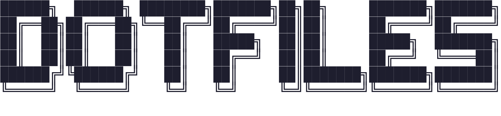
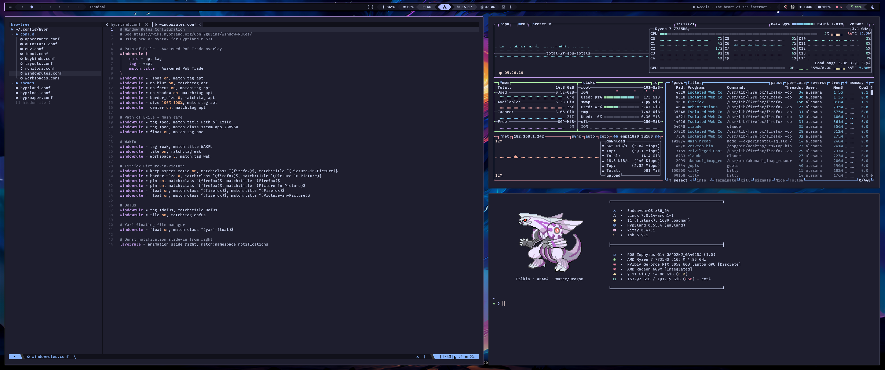
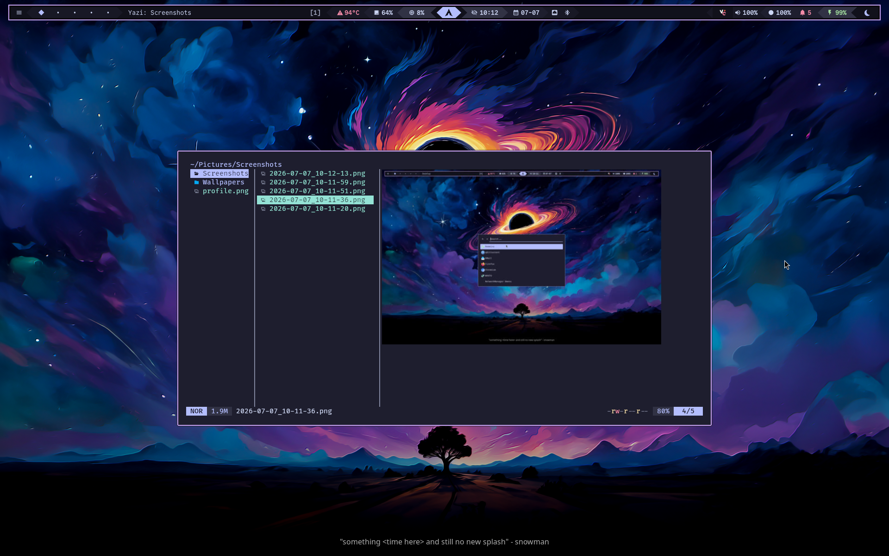

<div align="center">

<picture>
  <source media="(prefers-color-scheme: dark)" srcset=".github/assets/title-dark.png">
  
</picture>




</div>

## What's inside

- **[hyprland](https://github.com/hyprwm/Hyprland)** — WM ([i3](https://github.com/i3/i3) as X11 fallback)
- **[quickshell](https://quickshell.org)** — bar, notifications, OSDs, lock screen and every picker in one QML shell: app launcher, emoji, clipboard, network + VPN, Bluetooth, power menu, Bitwarden ([rbw](https://github.com/doy/rbw))
- **[sddm](https://github.com/sddm/sddm)** — login screen, custom theme matching the lock screen
- **[kitty](https://github.com/kovidgoyal/kitty) + [tmux](https://github.com/tmux/tmux) + [zsh](https://www.zsh.org) + [starship](https://github.com/starship/starship)** — terminal stack
- **[neovim](https://github.com/neovim/neovim) ([LazyVim](https://github.com/LazyVim/LazyVim))** — editor
- **[thunar](https://docs.xfce.org/xfce/thunar/start) + [yazi](https://github.com/sxyazi/yazi)** — file managers (GUI / terminal)
- **[imv](https://sr.ht/~exec64/imv/) + [mpv](https://mpv.io) + [zathura](https://pwmt.org/projects/zathura/)** — images / video / PDF
- **[fzf](https://github.com/junegunn/fzf) + [zoxide](https://github.com/ajeetdsouza/zoxide) + [mcfly](https://github.com/cantino/mcfly)** — fuzzy find / smart cd / history
- **[grim](https://github.com/emersion/grim) + [slurp](https://github.com/emersion/slurp) + [swappy](https://github.com/jtheoof/swappy) + [wl-clipboard](https://github.com/bugaevc/wl-clipboard) + [cliphist](https://github.com/sentriz/cliphist)** — screenshots & clipboard

## Features

Catppuccin Mocha on crust (`#11111b`) with a green accent, square corners and
sharp Breeze icons (green folders) across Hyprland, Quickshell, GTK, Qt/Kvantum,
kitty and Neovim.

Quickshell pickers share one look (title, search, keycap hints) and are
toggled over IPC — `qs -p ~/.config/quickshell/mocha ipc call <name> toggle`:

| Key | Picker |
|---|---|
| `Super+D` | app launcher |
| `Super+.` | emoji |
| `Super+Shift+V` | clipboard history (`/` to search) |
| `Super+Shift+N` | Wi-Fi + openfortivpn tunnels |
| `Super+Shift+B` | Bluetooth |
| `Super+Escape` | power menu |
| `Super+/` | Bitwarden (rbw, unlocks from the login keyring) |

> File manager — yazi floating, opens files in nvim



## Install

```bash
git clone --bare https://github.com/Green-Ranger11/dotfiles.git $HOME/.dotfiles
alias config='git --git-dir=$HOME/.dotfiles --work-tree=$HOME'

# back up conflicting files, then check out
mkdir -p ~/.dotfiles-backup
config checkout 2>&1 | grep -E "^\s" | awk '{print $1}' | xargs -I{} mv {} ~/.dotfiles-backup/{}
config checkout

config config --local status.showUntrackedFiles no
~/.config/scripts/install.sh
```
